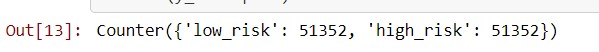
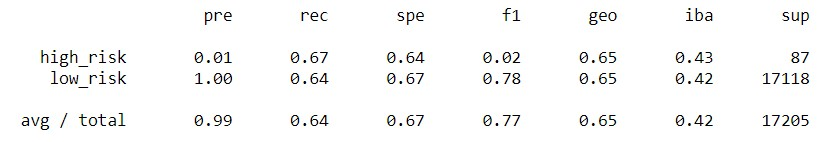
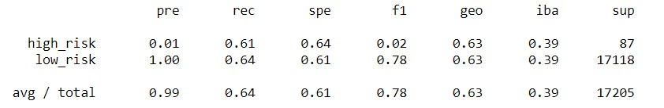
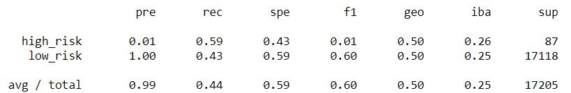
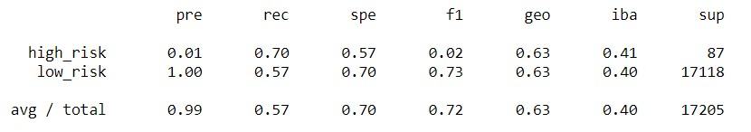
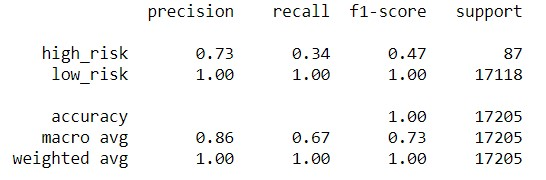
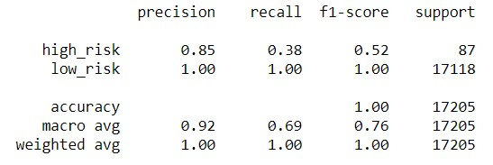

# Credit_risk_Analysis
## OVERVIEW
### Purpose
Fast lending, a peer to peer lending services, is a company that wants to predict credit risk using machine learning.  They think that the use of this kind of models will result in more accurate identification of good candidates for loans, which lead to lower default rates.
The company ask for assistance to implementing this plan, to help them, is necessary to build and evaluate several machine learning models that help to predict credit risk and have better clients
## RESULTS
From the database, the column “loan status” was the one selected to create the models and train the algorithm; it is divided in “low risk” and “high risk” values. Because of the size difference between them, various scopes were used in order to get more accuracy in the model results.

1.	The first approach was using the oversampling technique, taking a lot of samples of the minority (high risk) in order to have a similar number of elements of the majority sample (lower risk). 
As we can see in the image below, after oversampling process the counter was even:

With this new resampling the accuracy score of the model was only of 0.65139, with the next result in the imbalanced classification report:

As we can notice from the image above, the precision of the model for the “high risk” client identification is practically inexistent but apparently very good with the low risk client selection. This can be explained because of the original difference in the sample size, that, even using the oversampling method is still affecting the results.

2.	The second approach to make the analysis was making a SMOTE Oversampling; with this new modeling, the results of the imbalanced classification report are still very poor and the accuracy score even was worst, with a level of 0.626685, as we can see next:

With the SMOTE method the precision ratio still was inexistent for the “high risk” client identification and also is showing a very small value in the F1 score.

3.	Because oversampling and SMOTE don´t seem to be helpful for the purposes, the third approach is to make an undersampling, which adjusts the size  of the majority sample to the size of the minority one. Adjusting the model give us a lower level of accuracy which now is of 0.590291 the same “perfect” precision for the low risk prediction, a lower recall value of the high risk one, and its consistent small F1 value, as seen next:

4.	As noticed, the results of the tree first approaches didn’t work very well, because of that, a new model is used, combining the over and under sampling tools. With the use of the SMOTEEN algorithm the results are pretty much the same viewed all over the previous examples, contrary to the expectation, the accuracy is lower (0.5102725), also with a low precision for high risk predictions and a F1 small value

Because of the resampling results weren´t so good, a new scope is required. The first approach is developing a random forest classifier, with this, the accuracy reached was 0.99604766, with better precision and recall results as showed next

As we can see, the precision for the high-risk predictions now is 0.73 and the recall is 0.34 with a bigger F1 value.
Even the random forest results are not bad, an AdaBoost Classifier model was used to have a better performance, with it the accuracy increased to 99.651264 a “perfect” precision and recall values for the low risk predictions and for the high risk credits a very good precision indicator with a better recall and F1 score as seen next

## SUMMARY

After all the results obtained from the different developed models, because the data is imbalanced, the use of oversampling and undersampling methods didn’t get the desired results because of the lower precision numbers and F1 values. On the other hand, the use of random forests and the AdaBoost models gave better precision results for the high-risk predictions with their corresponding bigger F1 scores and very high accuracy levels. 
Because we are looking to estimate if a new credit is a high risk or a lower risk one, is important to have precision rates in order to have less false negatives. With the AdaBoost model, the results have a very good accuracy, a precision of 0.85 and a recall of 0.38, because of this results this model could be used in order to predict the credit risk of the new clients.

